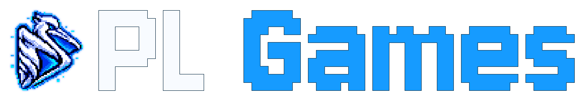

  

Launcher de jogos Windows para Linux com Proton, biblioteca de jogos, Pelinstall, ferramentas Wine, integração Nexus Mods e gerenciador de mods DLSSNR-AMD.

**0.3.0 — versão experimental para testes muito iniciais.** A publicação serve somente para testes e poderá ser removida posteriormente.

## Instalação

Baixe AppImage, RPM ou DEB em [Releases](https://github.com/pelicanux/PeliGames/releases).

- RPM e DEB instalam os binários `peligames` e `pelinstall` em `/opt/PeliGames`, com comandos em `/usr/bin` e atalhos nos diretórios de aplicativos do sistema. Pelo terminal, use `peligames` ou `pelinstall /caminho/programa.exe`.
- AppImage reúne os dois módulos. Dê permissão de execução e abra o arquivo. A primeira abertura registra o launcher e “Abrir com Pelinstall” para o usuário. Mantenha o AppImage no mesmo local para preservar os atalhos.
- Para abrir um executável Windows no instalador: `./PeliGames.AppImage --install /caminho/programa.exe`.

Proton, UMU e Winetricks são baixados conforme necessário. Configurações e ferramentas ficam em `~/.config/PeliGames`. O backend e os arquivos do mod ficam em `~/.config/PeliGames/Mod/DLSSNR`. O setup do mod, as teclas por jogo e os diretórios personalizados ficam em `~/.config/PeliGames/Mod/DLSSNR/config.json`; as preferências de inicialização do Neural Rendering ficam em `neural-startup.json` nessa mesma pasta. As preferências de capas e Proton permanecem em `~/.config/PeliGames/config.json`. Prefixos e jogos permanecem nos diretórios escolhidos pelo usuário. Capas do SteamGridDB exigem uma chave pessoal opcional, configurada em Preferências.

## Mods locais do Nexus

Conecte sua chave pessoal em **Conta Nexus** e escolha mods no **Catálogo**, ou importe arquivos ZIP, 7z e RAR pelo botão **Mod Local**. Para receber downloads do site, habilite **Usar PeliGames nos links Nexus** e escolha **Mod Manager Download**.

Contas gratuitas confirmam o download na página do Nexus; Premium permite download direto. Acompanhe a fila em **Downloads Nexus** e, na lista de mods, confira os requisitos antes de **Instalar**, **Ativar** ou **Desativar**.

O suporte depende do jogo e do formato do pacote. A chave fica no chaveiro do sistema; AppImage requer `secret-tool` e um chaveiro disponível. Use **Logs** ou **Reportar erro** para diagnosticar problemas.

## Créditos e licença

PeliGames é desenvolvido por Pelicano e distribuído sob [GNU GPL 3.0](LICENSE). Versões derivadas distribuídas devem disponibilizar o código-fonte correspondente sob a mesma licença.

Integra [DLSSNR-AMD, de mochizuki0323](https://github.com/mochizuki0323/DLSSNR-AMD), e [DLSSNR-RDNA3, de mauri870](https://github.com/mauri870/DLSSNR-RDNA3).

Os componentes de terceiros mantêm suas próprias licenças. Os [créditos e avisos completos](licenses/README.md) acompanham o programa e podem ser consultados na janela **Sobre**.

## Agradecimentos especiais

Obrigado aos desenvolvedores e às comunidades dos projetos que tornam possível jogar no Linux e dão suporte às ferramentas utilizadas pelo PeliGames:

- [GE-Proton — GloriousEggroll](https://github.com/GloriousEggroll/proton-ge-custom)
- [Proton CachyOS — equipe CachyOS](https://github.com/CachyOS/proton-cachyos)
- [UMU Launcher — Open Wine Components](https://github.com/Open-Wine-Components/umu-launcher)
- [Wine](https://www.winehq.org/) e [Proton — Valve e colaboradores](https://github.com/ValveSoftware/Proton)
- [DXVK](https://github.com/doitsujin/dxvk)
- [VKD3D-Proton](https://github.com/HansKristian-Work/vkd3d-proton)
- [Winetricks](https://github.com/Winetricks/winetricks)

Conheça e apoie esses projetos. Nosso agradecimento também a quem testa, relata problemas e contribui para melhorar os jogos no Linux.
