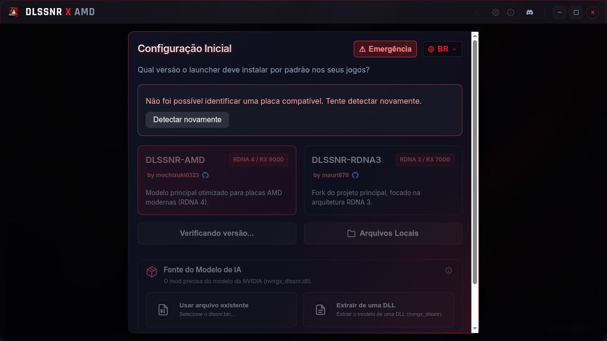

# Restauração do wizard — 6 de outubro de 2026

Fonte: `/home/pelicano/Documents/antigravity/dlss5-amd/dlssnr-installer-v3`.

Os arquivos abaixo foram restaurados e comparados byte a byte com a cópia original, sem diferenças:

- `src/components/SetupWizard.tsx`
- `src/App.tsx`
- `src/App.css`
- `src/i18n/translations.ts`
- `src/components/SettingsModal.tsx`
- `src/components/ResultModal.tsx`
- `src-tauri/src/commands/config.rs`

O arquivo intermediário `src/types/appConfig.ts` foi removido, pois o tipo voltou à origem anterior. A versão `0.0.1` e a proteção dos controles de janela para prévia no navegador foram mantidas.

## Verificações realizadas

| Verificação | Resultado |
| --- | --- |
| Comparação byte a byte dos sete arquivos | Passou. |
| `bun run build` | Passou, incluindo TypeScript. Aviso de tamanho do bundle. |
| Cargo check no Ubuntu/Distrobox | Passou. Avisos do código legado. |
| Abertura da prévia sem configuração nativa | Wizard exibido automaticamente. |
| Troca de idioma PT → EN → PT | Textos e seletor atualizados corretamente. |
| Abertura e cancelamento do painel de emergência | Painel abre e fecha; nenhuma redefinição executada. |
| Inspeção visual | Wizard exibido com os estilos originais restaurados. |

Comando usado para a verificação nativa:

```bash
distrobox enter ubuntu-dev -- bash -lc 'cd /home/pelicano/Documents/antigravity/PeliGames && CARGO_TARGET_DIR=/tmp/peligames-ubuntu-check cargo check --offline --manifest-path src-tauri/Cargo.toml'
```

O diretório de compilação separado evita misturar artefatos do host com os do Ubuntu. A tentativa no host não passou por falta de bibliotecas GTK; a tentativa inicial no container reutilizou artefatos incompatíveis do host. A verificação final no diretório separado passou.



## Limites da validação

A comparação confirma a restauração exata do código, dos estilos e das integrações removidas. A inspeção visual e as interações foram verificadas no navegador. Não foi feita uma comparação de imagens com o aplicativo nativo original nem uma instalação real de mod. A detecção de GPU, downloads, extração de modelo e instalação dependem do Tauri e não foram exercitados pela prévia web. No navegador, o aviso de GPU indisponível e os controles dependentes desativados são esperados.

A nova seção de mods ainda não foi implementada. Nesta restauração, o wizard volta a ter o comportamento inicial original; a mudança para uma seção própria será feita posteriormente.
